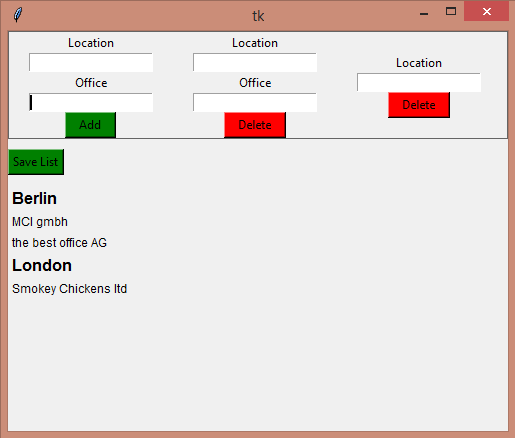

# Job Applications Tracker

Track your job applications and avoid applying for the same job multiple times.

## Motivation and goal

Purpose of this app is to create new entries of location and office name for applied jobs, so that you
never forget in which offices you did apply! :smile:

The motivation was to win time from searching on emails for applied jobs or that text file with the list of jobs
applied, that is somewhere in the computer, but no one knows where. :laughing:

## Dev environment and installation

This is a simple GUI app developed on [python](https://www.python.org/) with the famous [tkinter](https://docs.python.org/3/library/tk.html) library.

To run this app you need Python version 3 and nothing more, tkinter is included in the default python installation.
So just install python 3 and then

```
python app.py
```

## Features

Features include:

- Create new entries with location and office name

- Delete an existing office

- Delete an existing location

- Save your changes


The interface is at the moment very basic :pray:

